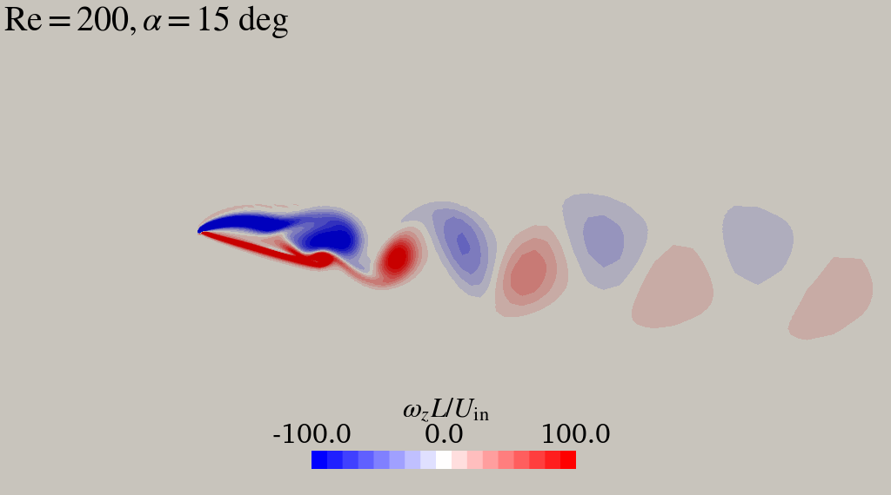

# draft-openfoam-flat-plate

Sample OpenFOAAM setup to illustatre the baffles feature to simulate a flat plate.

Simulation and mesh parameters have not been validated.

Fast lane: just run `bash launch.sh`



Run the `post.py` script to generate the animation.
Necessary modules for using the post processing python script are available
on `environment.yml`.
You can install it with conda:

```bash
conda env create --file environment.yml
```